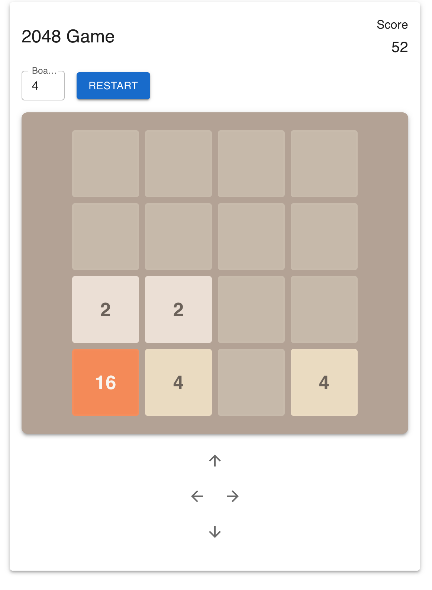
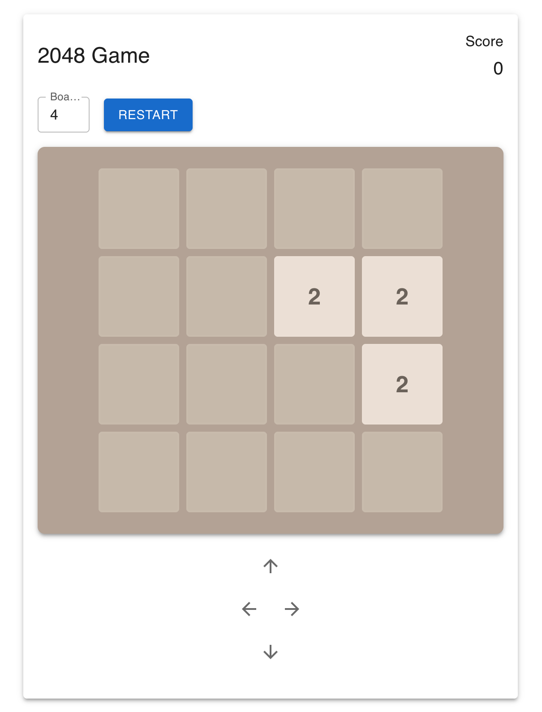
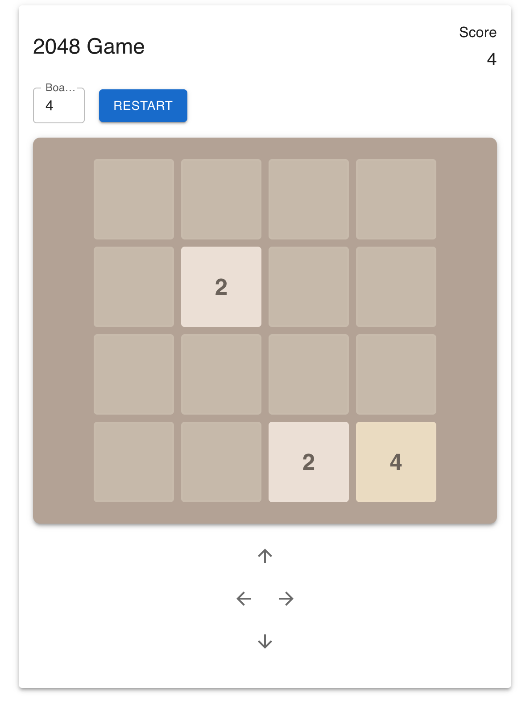
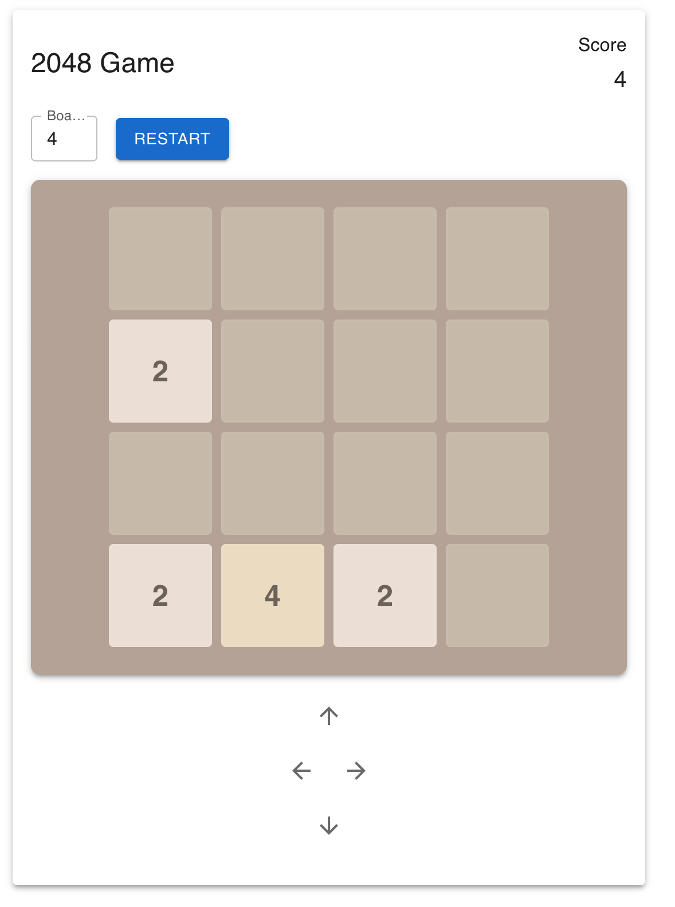
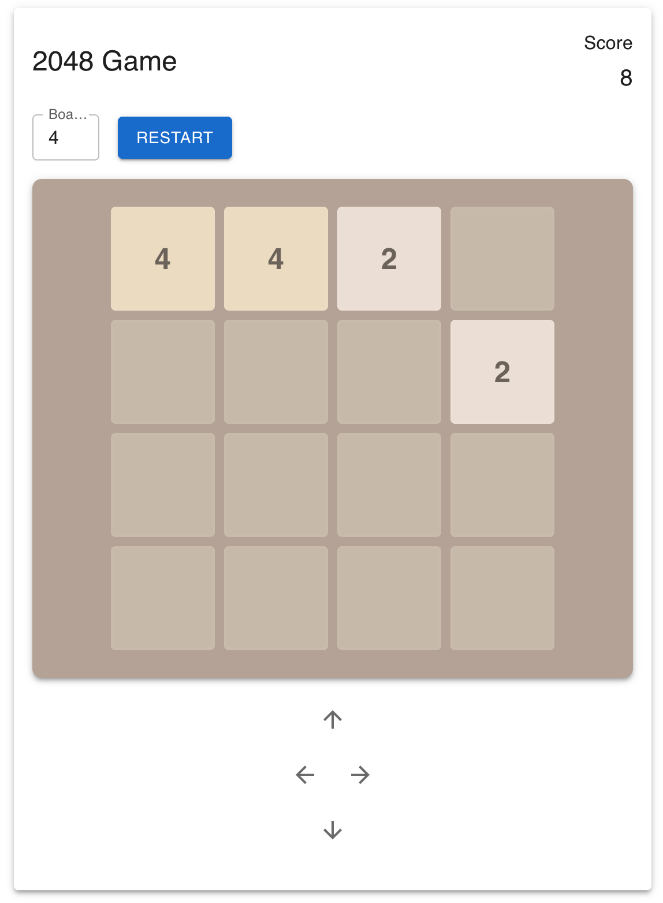
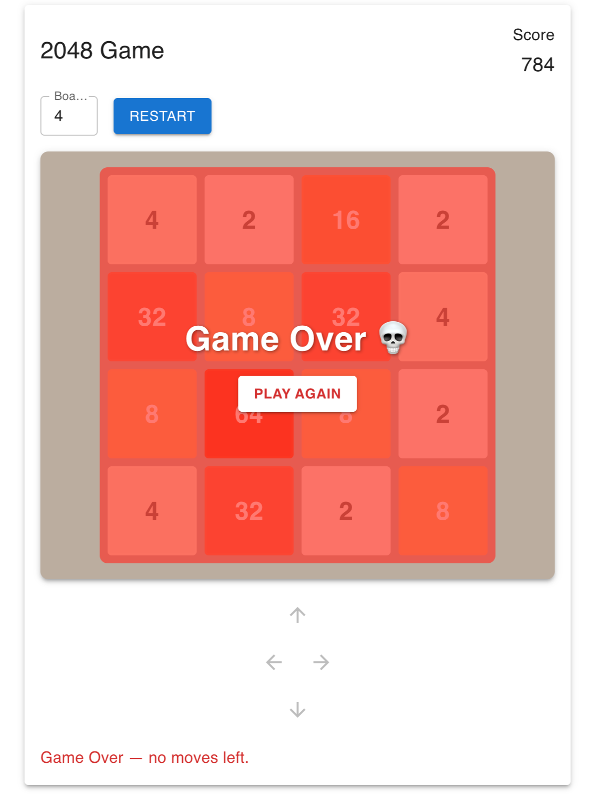
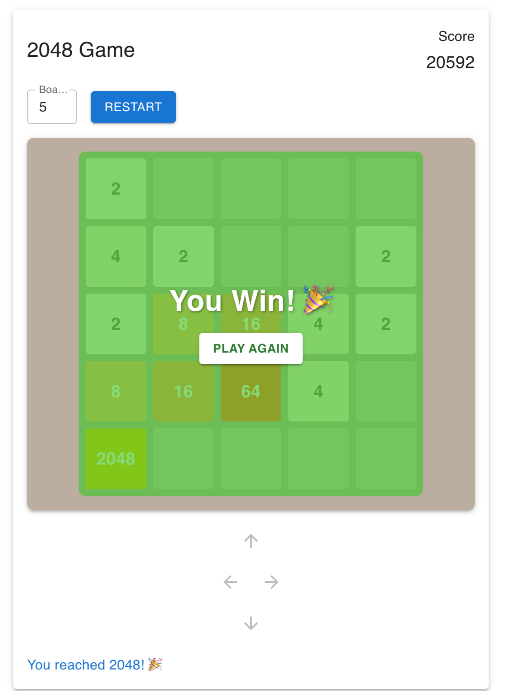

# 🎮 2048 Game

An interactive implementation of the classic **2048 game**, built using **Next.js** and **Material UI (MUI)**.  
The goal is simple: combine tiles with the same number to reach **2048**.  

---

## 🚀 Demo

Live Demo (Vercel):  
👉 [https://nextjs-2048.vercel.app/](#)

---

## 🧩 Features

✅ Dynamic, resizable board (configurable size 3×3 – 8×8)  
✅ Keyboard (arrow keys) & on-screen controls  
✅ Automatic tile merging and random tile generation  
✅ Live score tracking  
✅ Restart button  
✅ Win (green overlay) & Game Over (red overlay) screen  
✅ Clean functional architecture (hooks + pure functions)  

---

## ⚙️ Installation & Setup

### 1️⃣ Clone the repository
```bash
git clone https://github.com/hiteshdureja/nextjs-2048.git
cd nextjs-2048
```

### 2️⃣ Install dependencies
```bash
npm install
```

### 3️⃣ Run the development server
```bash
npm run dev
```

Open [http://localhost:3000](http://localhost:3000) in your browser.

### 4️⃣ Build for production
```bash
npm run build
npm start
```

---

## 🎮 Gameplay Instructions

1. The game starts with **two tiles (2 or 4)** randomly placed on the grid.  
2. Use **arrow keys** or **on-screen controls** to slide tiles:
   - ⬅️ Left  
   - ➡️ Right  
   - ⬆️ Up  
   - ⬇️ Down  
3. When two tiles with the same value collide, they **merge** into one with their sum.  
4. After every move, a new tile (2 or 4) appears at a random empty spot.  
5. **Goal:** Create the **2048 tile** to win.  
6. The game ends when **no valid moves remain**.

---
🖼️ Gameplay Screenshots


---
🧩 Initial Game Board


---
➡️ Move Right


---
⬇️ Move Down


---
⬅️ Move Left


---
⬆️ Move Up


---
💀 Game Over Screen


---
🏆 Winning Screen


---
## 🧠 Implementation Details

### 🏗️ Tech Stack
- **Next.js (Pages Router)** – framework for SSR and routing  
- **React Hooks (useState, useEffect)** – for reactive state management  
- **Material UI (MUI)** – for layout, controls, and responsive styling  
- **TypeScript** – for clean, type-safe code  

### 🧩 Architecture
| Folder | Description |
|---------|--------------|
| `/pages` | Application entry (`_app.tsx`, `index.tsx`) |
| `/components` | Reusable UI components (`Board`, `Tile`, `Controls`) |
| `/hooks` | Custom hook (`useGame`) to manage state and actions |
| `/utils` | Pure functional logic (`game.ts`: move, merge, spawn tiles) |
| `/styles` | Global CSS overrides |

### 🔍 Game Logic Highlights
- **Functional approach:** all board transformations are **pure functions**.  
- **State management:** handled by `useGame` hook (React’s functional pattern).  
- **Movement:** uses a rotation technique to handle up/down/left/right via a common “move left” logic.  
- **Immutability:** each move creates a **new board state** instead of mutating the old one.  
- **Overlays:** implemented in `Board.tsx` with MUI boxes and dynamic coloring.

### 🧮 Key Functions (in `utils/game.ts`)
| Function | Description |
|-----------|--------------|
| `createEmptyBoard(size)` | Creates a blank grid |
| `addRandomTile(board)` | Adds a 2 or 4 in a random empty spot |
| `moveBoard(board, direction)` | Handles movement, merging, and score update |
| `canMoveBoard(board)` | Checks if any valid moves remain |
| `hasWon(board)` | Returns `true` if a tile ≥ 2048 exists |

